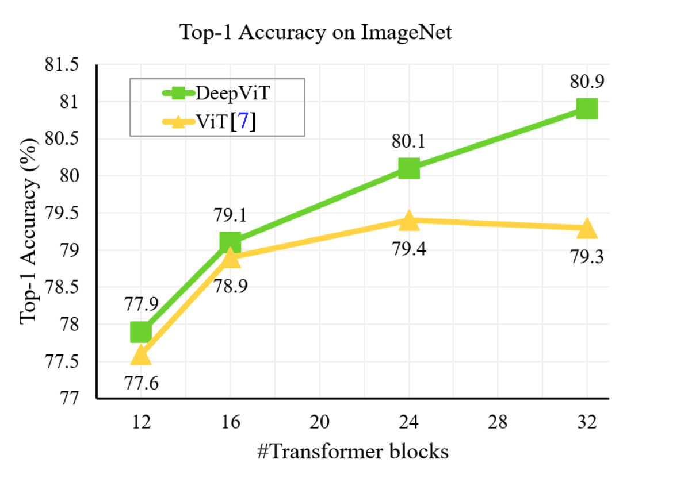

# Transformer
## 1. An Image is Worth 16x16 Words: Transformers for Image Recognition at Scale.

## 2. DeepViT: Towards Deeper Vision Transformer.
ViTs has been successfully applied in image classification tasks recently. Can we improve the performance of ViTs when scaled to be deeper.
### 2.1 Attention collapse
正如我们通过增加CNN的深度来提升模型的性能，我们也想通过增加transformer块的个数来提升模型的性能。不失一般性，我们可以固定隐藏层的维度和多头的个数，只改变transformer块的个数来构建不同的ViT模型，测试不同的模型在ImageNet上的性能，我们发现当transformer块达到一定数量后，再增加块的个数，模型的性能也不会有很大的提升，达到了饱和，这限制了ViTs在图片分类任务上的应用。
</img>
作者认为于当transformer块的个数增加的时候，不同的transformer块学出来的特征是相似的甚至是相同的，为了验证作者的猜想。